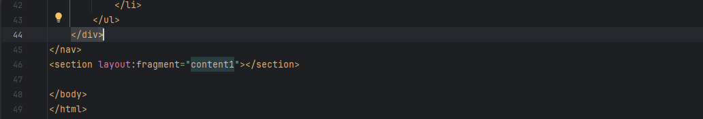

#  Gestion des Patients - Spring Boot App

> Mise en œuvre de Spring MVC, Spring Data JPA, Thymeleaf, et Spring Security

---

##  Sommaire

- [Introduction](#introduction)
- [Objectif](#objectif)
- [Technologies utilisées](#technologies-utilisées)
- [Architecture du projet](#architecture-du-projet)
- [Structure du projet](#-structure-du-projet)
- [Fonctionnalités](#-fonctionnalités)
- [Explication des composants](#-explication-des-composants)
- [Lancer l'application](#-lancer-lapplication)
- [Conclusion](#-conclusion)

---
## Introduction

Ce projet consiste en une application web de gestion des patients pour un hôpital, développée avec Spring Boot. L'application intègre Spring MVC pour la couche web, Spring Data JPA pour la persistance des données, Thymeleaf comme moteur de templates et Spring Security pour la gestion de l'authentification et des autorisations.

---
##  Objectif

Créer une application web de gestion des patients en utilisant Spring Boot, avec les fonctionnalités suivantes :
- Affichage des patients avec pagination
- Modifier les informations d'un patient
- Recherche par mot-clé
- Suppression des patients
- Formulaire d’ajout/édition avec validation
- Sécurité avec Spring Security
- Authentification via Spring Security
- Différenciation des rôles : USER, ADMIN
- 
---
## Technologies utilisées

###  Backend

  
  
  
  

###  Frontend

  
  
  

###  Base de données

  

###  Outils

  
  

---
##  Architecture du projet

    src/
    └── main/
    ├── java/ma.enset.tp3_springmvc_hopital/
    │   ├── entities/           # Contient les entités JPA (Patient, AppUser, AppRole)
    │   ├── repository/         # Contient les interfaces de repository JPA
    │   ├── security/
    │   │   ├── entities/     # Entités de sécurité (AppUser, AppRole)
    │   │   ├── repository/   # Repositories des entités de sécurité
    │   │   ├── service/      # Logique métier pour gestion des comptes
    │   │   └── SecurityConfig   # Configuration Spring Security
    │   ├── web/               # Contrôleurs Web MVC
    │   └── HopitalApplication.java # Classe principale Spring Boot
    └── resources/
    ├── templates/           # Fichiers HTML Thymeleaf
    ├── static/              # Ressources statiques
    ├── application.properties
    └── schema.sql           # Initialisation de la base

---
##  Explication des composants
### entities
- Contient les entités JPA qui modélisent les données stockées dans la base.

#### `Patient.java`
> Classe entité mappée à la table `patients`.

### repository
- Contient les interfaces DAO pour accéder aux données via Spring Data JPA.
#### `PatientRepository.java`
> Interface Spring Data JPA pour les opérations CRUD sur les patients avec une méthode de recherche personnalisée.  

### security.entities
- Contient les entités liées à la gestion des utilisateurs et des rôles.
#### `AppUser.java`
> Représente un utilisateur de l’application (admin, user...).

#### `AppRole.java` 
> Représente un rôle attribuable à un utilisateur (ROLE_USER, ROLE_ADMIN).

### security.repository
#### `AppUserRepository`
> DAO pour gérer les utilisateurs (AppUser) dans la base.

#### `AppRoleRepository`
> DAO pour gérer les rôles (AppRole).

### security.service
- Contient les services liés à la gestion de la sécurité et des comptes.

#### `AccountService (interface)`
Déclare les méthodes pour gérer les utilisateurs et les rôles.

#### `AccountServiceImpl (implémentation)` 
    Implémente la logique pour :
       - Ajouter un utilisateur
       - Ajouter un rôle
       - Associer un rôle à un utilisateur

#### `UserDetailServiceImpl` 
> Classe utilisée par Spring Security pour charger les détails d’un utilisateur à partir de la base.

### security.SecurityConfig
    - Contient la configuration de Spring Security :
    
      + Authentification en mémoire (InMemoryUserDetailsManager)
    
      + Configuration des filtres de sécurité (SecurityFilterChain)
    
      + Gestion des droits d’accès selon les rôles (ROLE_USER, ROLE_ADMIN)

### web
- Contient les contrôleurs web (MVC) qui reçoivent les requêtes HTTP.

#### `PatientController` 
> Contrôleur principal :Gère les requêtes HTTP liées aux patients (affichage, suppression, édition).

#### `SecurityController` 
> Contrôleur pour gérer les erreurs de sécurité (ex. accès non autorisé).

#### `HopitalApplication` 
> Classe principale avec l’annotation @SpringBootApplication qui démarre l'application.

### Fichiers de Configuration
#### `application.properties`
> Contient la configuration de la connexion à la base de données, le port du serveur, les paramètres Spring Security, etc.

### Templates HTML (Thymeleaf)
- Situés dans src/main/resources/templates, ils sont utilisés pour afficher l’interface utilisateur :

#### patients.html : 
> Liste paginée des patients.

#### formPatient.html : 
> Formulaire d'ajout d’un nouveau patient.

#### editPatient.html : 
> Formulaire de modification d’un patient existant.

#### login.html : 
> Formulaire de connexion.

#### notAuthorized.html : 
> Affichage d’erreur d’accès interdit.

#### template1.html : 
> Template de base pour layout.

---
## Aperçu de l'application
- Voici les principales interfaces :

### Page de login (login.html)

- Cette application de gestion des patients permet aux utilisateurs authentifiés d'accéder à différentes fonctionnalités selon leur rôle :
#### Rôle Admin :
  - L'administrateur a un accès complet au système :
       Consulter la liste des patients
       Modifier les informations d’un patient
       Supprimer un patient

#### Rôle User :
    - L’utilisateur avec le rôle USER dispose d’un accès limité :
         Peut voir la liste des patients
         Peut rechercher un patient par mot-clé
         Ne peut pas modifier ni supprimer les patients

### Liste des patients avec pagination et recherche (patients.html)

### Formulaire d’édition (editPatient.html)

### Page d’erreur d’accès (notAuthorized.html)

---
## Conclusion
Ce projet de gestion des patients dans un hôpital illustre une application complète basée sur le framework Spring Boot MVC, en intégrant la gestion de la sécurité avec Spring Security, une base de données relationnelle via JPA/Hibernate, et une interface utilisateur dynamique avec Thymeleaf.
Grâce à une architecture bien structurée en couches (entités, repository, service, web), cette application facilite la maintenance, l’extension et la réutilisabilité du code.

Ce travail m’a permis de mettre en pratique mes compétences en développement web full-stack Java, tout en respectant les bonnes pratiques d’architecture logicielle.

### Réalisé par : Sara EL AMRANI (GLSID)
### D’après les cours de M. Mohamed Youssfi

